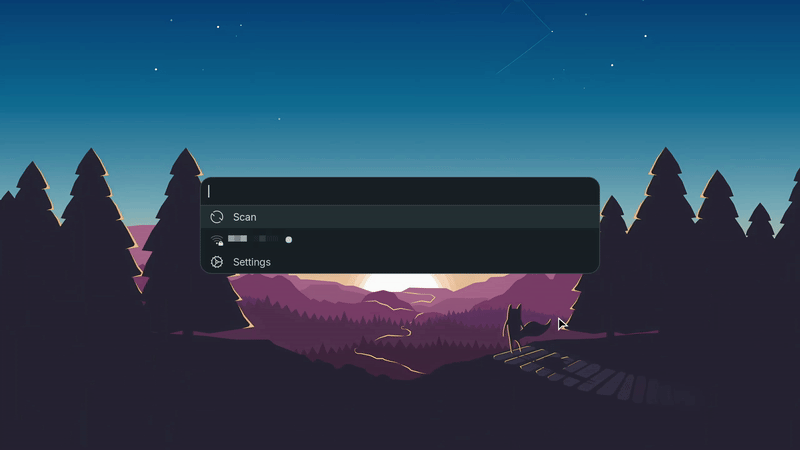

<div align="center">
  <h1>iwmenu</h1>
  <p>
    <a href="https://ko-fi.com/e_tho"></a>
    <a href="https://liberapay.com/e-tho"></a>
  </p>
  
</div>

## About

`iwmenu` (**i**Net **W**ireless **Menu**) allows using your menu of choice to manage the wireless network.

## Dependencies

### Build

- [`Rust`](https://www.rust-lang.org/) (includes `cargo`)

### Runtime

- [`iwd`](https://iwd.wiki.kernel.org) – iNet Wireless Daemon
- [`dbus`](https://www.freedesktop.org/wiki/Software/dbus) – For communicating with `iwd`
- A launcher with `stdin` mode support

#### Optional

- [NerdFonts](https://www.nerdfonts.com/) – For font-based icons (default mode)
- [XDG icon theme](https://specifications.freedesktop.org/icon-theme-spec/latest) – For image-based icons (used with `-i xdg`, included with DEs or can be installed manually)
- [Notification daemon](https://specifications.freedesktop.org/notification-spec/latest/) – For system notifications (e.g. `dunst` or `fnott`, included with DEs or can be installed manually)

## Compatibility

| Launcher                                      | Font Icons | XDG Icons | Notes                                                                                 |
| --------------------------------------------- | :--------: | :-------: | ------------------------------------------------------------------------------------- |
| [Fuzzel](https://codeberg.org/dnkl/fuzzel)    |     ✅     |    ✅     | XDG icons supported in main branch                                                    |
| [Rofi](https://github.com/davatorium/rofi)    |     ✅     |    🔄     | XDG icon support pending via [PR #2122](https://github.com/davatorium/rofi/pull/2122) |
| [Walker](https://github.com/abenz1267/walker) |     ✅     |    ✅     | XDG icons supported since v0.12.21                                                    |
| [dmenu](https://tools.suckless.org/dmenu)     |     ✅     |    ❌     | No XDG icon support                                                                   |
| Custom (stdin)                                |     ✅     |    ❔     | Depends on launcher implementation                                                    |

> [!TIP]
> If your preferred launcher isn't directly supported, use `custom` mode with appropriate command flags.

> [!NOTE]
> For proper XDG icon display launchers must support fallback icons in `stdin` mode with comma-separated values. This ensures compatibility with various themes and desktop environments.

## Installation

### Build from source

Run the following commands:

```shell
git clone https://github.com/e-tho/iwmenu
cd iwmenu
cargo build --release
```

An executable file will be generated at `target/release/iwmenu`, which you can then copy to a directory in your `$PATH`.

### Nix

Add the flake as an input:

```nix
inputs.iwmenu.url = "github:e-tho/iwmenu";
```

Install the package:

```nix
{ inputs, ... }:
{
  environment.systemPackages = [ inputs.iwmenu.packages.${pkgs.system}.default ];
}
```

### Arch Linux

Install the package with your favorite AUR helper:

```shell
paru -S iwmenu-git
```

### Gentoo

Install the package from [GURU overlay](https://wiki.gentoo.org/wiki/Project:GURU):

```shell
sudo eselect repository enable guru
sudo emaint sync -r guru
sudo emerge -a net-wireless/iwmenu
```

## Usage

### Supported menus

Specify an application using `-m` or `--menu` flag.

```shell
iwmenu -m fuzzel
```

### Custom menus

Specify `custom` as the menu and set your command using the `--menu-command` flag. Ensure your launcher supports `stdin` mode, and that it is properly configured in the command.

```shell
iwmenu -m custom --menu-command "my_custom_launcher --flag"
```

#### Prompt and Placeholder support

Use either `{prompt}` or `{placeholder}` as the value for the relevant flag in your command; each will be replaced with the appropriate text as needed. They return the same string, with `{prompt}` adding a colon at the end.

```shell
iwmenu -m custom --menu-command "my_custom_launcher --prompt-flag '{prompt}'" # or --placeholder-flag '{placeholder}'
```

#### Password obfuscation support

To enable support for password obfuscation, set the appropriate flag via `{password_flag:--my-password-flag}`.

```shell
iwmenu -m custom --menu-command "my_custom_launcher {password_flag:--my-password-flag}"
```

#### Example to enable all features

This example demonstrates enabling all available features in custom mode with `fuzzel`.

```shell
iwmenu -m custom --menu-command "fuzzel -d -p '{prompt}' {password_flag:--password}"
```

### Available Options

| Flag             | Description                                           | Supported Values                              | Default Value |
| ---------------- | ----------------------------------------------------- | --------------------------------------------- | ------------- |
| `-m`, `--menu`   | Specify the menu application to use.                  | `dmenu`, `rofi`, `fuzzel`, `walker`, `custom` | `dmenu`       |
| `--menu-command` | Specify the command to use when `custom` menu is set. | Any valid shell command                       | `None`        |
| `-i`, `--icon`   | Specify the icon type to use.                         | `font`, `xdg`                                 | `font`        |
| `-s`, `--spaces` | Specify icon to text space count (font icons only).   | Any positive integer                          | `1`           |

## License

GPLv3

## Support this project

If you find this project useful and would like to help me dedicate more time to its development, consider supporting my work.

[](https://ko-fi.com/e_tho)
[](https://liberapay.com/e-tho)
